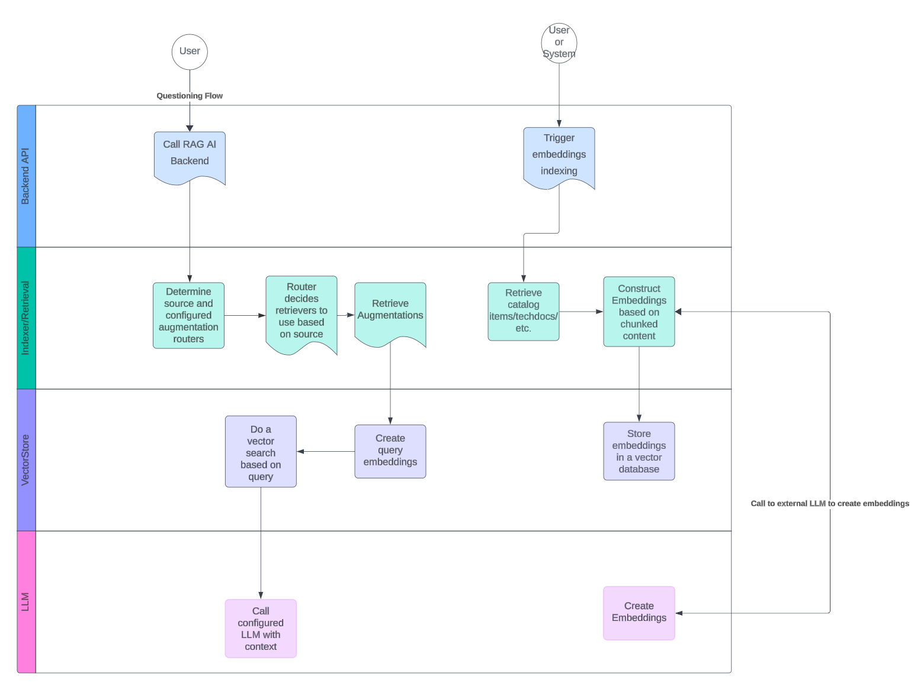
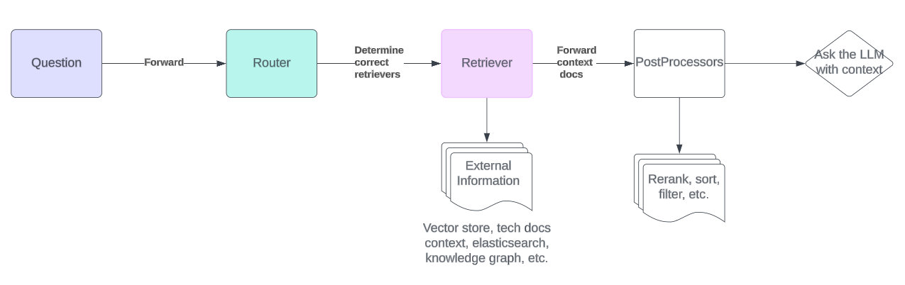

# Roadie RAG AI Backend plugin for Backstage

This plugin is the backend for RAG AI Backstage plugin. You can see the corresponding frontend plugin in [here](/plugins/frontend/rag-ai/README.md).

This plugin provides functionality to install and configure a Retrieval Augmented Generation backend within your Backstage instance. The plugin is capable of creating embeddings to enhance questions asked from LLMs with contextual information from your Backstage catalog, giving you the opportunity to get tailored responses based on your company's entities and other configured data sets. The plugin is configurable with customizable prompts, vector embeddings queries, additional search based embeddings and can be extended to support any LLM providing an API.





# Configuration

The RAG AI Backend does not contain bindings for the supported LLMs themselves, but those will need to be injected into the plugin during configuration phase.

The plugin expects 3 different pieces of implementations to work optimally:

- Embeddings module
  - This provides the functionality to create, manage and search embeddings that can be added to the prompts when querying the LLM
  - Currently, you can find embeddings modules for [AWS Bedrock](/plugins/backend/rag-ai-backend-embeddings-aws/README.md) and [OpenAI](/plugins/backend/rag-ai-backend-embeddings-openai/README.md).
- Large Language Model
  - This is the actual model to be used when asking questions.
  - The supported LLMs come from `langchain` and `@langchain/community` packages. It is recommended to use the same provider as is used for embeddings.
- Vector Storage
  - A Vector store to store and query embeddings to/from. The provided Backstage PostgreSQL compatible implementation is [RAG AI Storage PGVector](/plugins/backend/rag-ai-storage-pgvector/README.md) package within this repository.

The configuration examples for each embedding and vector storage are listed below.

## Configuration schema

Below is the full configuration schema. For individual LLM provider, choose one of the options (currently between OpenAI and AWS Bedrock).

```yaml
# Roadie RAG AI configuration
ai:
  # (Optional) Supported sources to query information from using RAG. This can be used to omit unnecessary sources from being retrievable. Defaults to [catalog]
  supportedSources: ['catalog']

  # (Optional) Texts to inject to the prompts when querying the LLM. Defaults to hardcoded prompts within the codebase.
  prompts:
    # (Optional) Prefix prompt to add to the query. This prompt is always succeeded by a text blob of embeddings retrieved by the RAG engine.
    prefix: 'you are an LLM designed to do this and that... based on... Use the following documents to...'

    # Suffix prompt to add to the query. This prompt is always succeeded by text query user has input.
    suffix: 'Begin! \n Question: \n'

  storage:
    pgvector:
      # (Optional) The size of the chunk to flush when storing embeddings to the DB. Defaults to 500
      chunksize: 500

  # Embeddings engine configuration options
  embeddings:
    # Generic embeddings options
    # (Optional) The chunk size of an embedding. Determines how big or small the individual pieces of context stored alongside the vectors and sent to the LLM are. Defaults to 1000
    chunkSize: 1000

    # (Optional) The overlap between adjacent chunks of embeddings. The bigger the number, the more overlap. Defaults to 200
    chunkOverlap: 200

    # AWS Bedrock Embeddings configuration
    awsBedrock:
      # (Required) Name of the Bedrock model to use to create Embeddings.
      modelName: 'amazon.titan-embed-text-v1'

      ## AWS Bedrock uses integration-aws-node package to configure credentials. See the package README for more info.

    # OpenAI Embeddings configuration
    openai:
      # (Optional) The API key for accessing OpenAI services. Defaults to process.env.OPENAI_API_KEY
      openAIApiKey: 'sk-123...'

      # (Optional) Name of the OpenAI model to use to create Embeddings. Defaults to text-embedding-3-small
      modelName: 'text-embedding-3-small'

      # (Optional) The size of the batch to use when creating embeddings. Defaults to 512, max is 2048
      batchSize: 512

      # (Optional) The number of dimensions to generate. Defaults to use the default value from the chosen model
      embeddingsDimensions: 1536
```

<details><summary>Example minimal configuration</summary>

```yaml
aws:
  mainAccount:
    accessKeyId: ${BEDROCK_AWS_ACCESS_KEY_ID}
    secretAccessKey: ${BEDROCK_AWS_SECRET_ACCESS_KEY}

ai:
  embeddings:
    bedrock:
      modelName: 'amazon.titan-embed-text-v1'
```

</details>

## PGVector Vector Storage Configuration

See more information from the [module package](/plugins/backend/rag-ai-storage-pgvector/README.md).

To store embeddings vectors in the same database as the rest of your Backstage application. You can use the `rag-ai-storage-pgvector` package. Currently only PostgreSQL is supported.

> Note, you need to have `uuid-ossp` and `vector` PostgreSQL extensions available on your database to be able to use this module.

### How to initialize

You can use the exported `createRoadiePgVectorStore` function to initialize the RoadiePGVectorStore. This initialization function expects an instance of logger and a Knex DB connection.

Here is a TypeScript example:

```typescript
const config = {
  logger: Logger, // logger instance
  db: Knex, // database connection provided by Knex
  options: {
    chunkSize: number, // (optional) amount of documents to chunk when adding vectors, default is 500
    tableName: string, // (optional) Table naming to use to store embeddings. Default is 'embeddings'
  },
};

const vectorStore = await createRoadiePgVectorStore({
  logger,
  database,
  options: { chunkSize, tableName },
});
```

## Retrieval Pipeline Configuration

See more information from the [module package](/plugins/backend/rag-ai-backend-retrieval-augmenter/README.md).

The Roadie RAG AI backend expects a retrieval pipeline that is used to retrieve augmentation context when querying information from the LLM. This retrieval pipeline retrieves, processes and sorts information based on queries and other information, providing data that can be used to augment the query sent to the LLM.

This repository provides default retrieval pipeline implementations that can be configured to retrieve as much (or as little ) data as is needed. The pipeline can also be run in a pass-through mode where additional context is not added to the queries and users can interact with the configured LLMs directly.

A bare-bones implementation of the pipeline can be initialized by calling the `DefaultRetrievalPipeline` constructor with an empty configuration object (`{}`).

To start appending important functionality to the RAG pipeline, it is recommended to start implementing and using routers to define correct augmentation information retrievers and to use post processor with enough logic to rerank, sort, and manipulate the retrieved information. The initial starting point, to use a vector store with optional search functionality, is provided by Roadie within this repository. You can get a naive RAG pipeline running this way and start tweaking and configuring the optimal embeddings configuration to provide relevant context for your queries.

```typescript
const retrievalPipeline = createDefaultRetrievalPipeline({
  discovery,
  logger,
  vectorStore: augmentationIndexer.vectorStore,
  tokenManager,
});
```

> You are able to get the vector store implementation from your constructed augmentation indexer. See below for more information.

## Embeddings configurations

The RAG AI plugin depends largely on embeddings submodules to construct good and relevant embeddings that can be included as a context to the queries sent to configured LLMs. There are two implementations included within this repository, as well as a base functionality to construct initial embeddings.

> It is highly recommended to modify these embeddings creations and retrievals to match the specific use case you are targeting with this plugin.

Below are the configuration examples on how to initialize and use the included submodules.

### AWS Bedrock Configuration

See more information from the [module package](/plugins/backend/rag-ai-backend-embeddings-aws/README.md).

1. In your project, import the necessary modules from the appropriate packages as shown in the sample code.

2. Get your AWS credentials from AWS console and add them to your environment variables, or use any other preferred method. See more information how to configure credentials from [`@backstage/integration-aws-node` package README](https://github.com/backstage/backstage/blob/master/packages/integration-aws-node/README.md)

3. Initialize a vector storage solution that can be used to configure the embeddings module.

4. Initialize AWS Bedrock embeddings using the `initializeBedrockEmbeddings` function.

5. Create an instance of AWS Bedrock LLM, by using the `Bedrock` dependency from `@langchain/community` packages.

6. Finally, initialize the AI Backend, 'ragAi', using `initializeRagAiBackend` with the just configured Embeddings module as well as the configured LLM.

```typescript
import { createApiRoutes as initializeRagAiBackend } from '@roadiehq/rag-ai-backend';
import { PluginEnvironment } from '../types';
import { createRoadiePgVectorStore } from '@roadiehq/rag-ai-storage-pgvector';
import { CatalogClient } from '@backstage/catalog-client';
import { createDefaultRetrievalPipeline } from '@roadiehq/rag-ai-backend-retrieval-augmenter';
import { initializeBedrockEmbeddings } from '@roadiehq/rag-ai-backend-embeddings-aws';
import { DefaultAwsCredentialsManager } from '@backstage/integration-aws-node';
import { Bedrock } from '@langchain/community/llms/bedrock';

export default async function createPlugin({
  logger,
  tokenManager,
  database,
  discovery,
  config,
}: PluginEnvironment) {
  const catalogApi = new CatalogClient({
    discoveryApi: discovery,
  });

  const vectorStore = await createRoadiePgVectorStore({
    logger,
    database,
    config,
  });

  const awsCredentialsManager = DefaultAwsCredentialsManager.fromConfig(config);
  const credProvider = await awsCredentialsManager.getCredentialProvider();
  const augmentationIndexer = await initializeBedrockEmbeddings({
    logger,
    tokenManager,
    catalogApi,
    vectorStore,
    discovery,
    config,
    options: {
      region: 'us-east-1',
      credentials: credProvider.sdkCredentialProvider,
    },
  });

  const model = new Bedrock({
    maxTokens: 4096,
    // model: 'anthropic.claude-instant-v1', // 'amazon.titan-text-express-v1', 'anthropic.claude-v2', 'mistral-xx'*
    model: 'amazon.titan-text-express-v1',
    region: 'us-east-1',
    credentials: credProvider.sdkCredentialProvider,
  });

  const ragAi = await initializeRagAiBackend({
    logger,
    tokenManager,
    augmentationIndexer,
    retrievalPipeline: createDefaultRetrievalPipeline({
      discovery,
      logger,
      vectorStore: augmentationIndexer.vectorStore,
      tokenManager,
    }),
    model,
    config,
  });
  return ragAi.router;
}
```

### OpenAI Configuration

See more information from the [module package](/plugins/backend/rag-ai-backend-embeddings-openai/README.md).

1. In your project, import the necessary modules from the appropriate packages as shown in the sample code.

2. Get your OpenAI API token from https://platform.openai.com/api-keys

3. Initialize a vector storage solution that can be used to configure the embeddings module.

4. Initialize OpenAI embeddings using the `initializeOpenAiEmbeddings` function.

5. Create an instance of OpenAI LLM, by using the `OpenAI` dependency from `@langchain/openai` packages.

6. Finally, initialize the AI Backend, 'ragAi', using `initializeRagAiBackend` with the just configured Embeddings module as well as the configured LLM.

```typescript
// './plugins/ai'

import { createApiRoutes as initializeRagAiBackend } from '@roadiehq/rag-ai-backend';
import { initializeOpenAiEmbeddings } from '@roadiehq/rag-ai-backend-embeddings-openai';
import { createRoadiePgVectorStore } from '@roadiehq/rag-ai-storage-pgvector';
import { createDefaultRetrievalPipeline } from '@roadiehq/rag-ai-backend-retrieval-augmenter';
import { OpenAI } from '@langchain/openai';
import { CatalogClient } from '@backstage/catalog-client';
import { DefaultAwsCredentialsManager } from '@backstage/integration-aws-node';

export default async function createPlugin({
  logger,
  database,
  discovery,
  config,
}: PluginEnvironment) {
  const catalogApi = new CatalogClient({
    discoveryApi: discovery,
  });

  const vectorStore = await createRoadiePgVectorStore({ logger, database });

  const augmentationIndexer = await initializeOpenAiEmbeddings({
    logger,
    catalogApi,
    vectorStore,
    discovery,
    config,
  });

  const model = new OpenAI();

  const ragAi = await initializeRagAiBackend({
    logger,
    augmentationIndexer,
    retrievalPipeline: createDefaultRetrievalPipeline({
      discovery,
      logger,
      vectorStore: augmentationIndexer.vectorStore,
      tokenManager,
    }),
    model,
    config,
  });

  return ragAi.router;
}
```

## Router Endpoint configuration

The `@roadiehq/rag-ai-backend` exposes a router function that can be registered directly into a standard Backstage application.

```typescript
import ai from './plugins/ai';
// ...
async function main() {
  // ...
  const aiEnv = useHotMemoize(module, () => createEnv('ai'));
  const apiRouter = Router();
  apiRouter.use('/rag-ai', await ai(aiEnv));
  // ...
}
```

## Embeddings creation

The `@roadiehq/rag-ai-backend` plugin does not automatically generate Embeddings or index contexts of catalog items, instead it exposes an endpoint that allows you to configure either a periodical or event based embedding generation. This approach is taken to minimize the financial impact when calling potentially expensive third party LLM endpoints. Creating embeddings from large catalog items or tech docs maybe produce large amounts of data and make multiple calls to generate embeddings.

The ideal option to manage embeddings creation is to make them event based. They should be triggered when new information has been added into the system.

> If you don't want to create embeddings and don't want to provide contextual information to your queries, you can configure the plugin prompt templates to not refer to embedded contextual information, thus providing you an interface to ask generic questions from configured LLMs.

### Calling the endpoint

The endpoint exposed from the plugin lives under a path `/embeddings/:source`. Assuming the application is running on localhost port 7007 and the `@roadiehq/rag-ai-backend` is mounted on path `rag-ai` the call to construct embeddings for Catalog entries of kind `component` would be the following:

```bash
curl --request POST \
  --url http://localhost:7007/api/rag-ai/embeddings/catalog \
  --data '{
  "entityFilter": {
    "kind": "component"
  }
}'
```

The endpoint expects a supported source type and a POST request body containing an `entityFilter` in a similar format that the common entity filter within the Backstage project is used.

### Scheduling periodical embeddings creation

You can also periodically schedule embeddings creation endpoint to be called. It might be beneficial to compare the existing already created embeddings or possible do some additional diff checking before periodically creating embeddings for the whole catalog. In a lot of cases the information within the catalog does not change that often and uselessly calling paid 3rd party APIs may become expensive if done periodically without guardrails.

```typescript
import { PluginTaskScheduler } from '@backstage/backend-tasks';
import { Knex } from 'knex';

export const configureEmbeddingsCreation = async (opts: {
  discovery: PluginEndpointDiscovery;
  scheduler: PluginTaskScheduler;
  logger: Logger;
}) => {
  const { logger, discovery, scheduler } = opts;

  const scheduleLogger = logger.child({ name: 'EmbeddingsCreationScheduler' });
  const baseUrl = await discovery.getBaseUrl('rag-ai');
  scheduler.scheduleTask({
    id: 'create-catalog-embeddings',
    frequency: { days: 1 },
    initialDelay: { seconds: 30 },
    timeout: { seconds: 180 },
    fn: async () => {
      const url = '${baseUrl}/embeddings/catalog';
      const options = {
        method: 'POST',
        body: '{"entityFilter":{"kind":"component"}}',
      };

      try {
        const response = await fetch(url, options);
        const data = await response.json();
        scheduleLogger.info(data);
      } catch (error) {
        scheduleLogger.error(error);
      }
    },
  });
};
```
