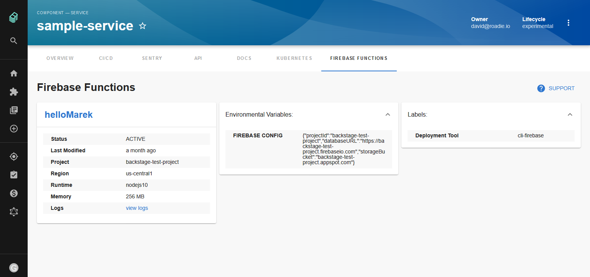

# Firebase Functions Plugin for Backstage



[https://roadie.io/backstage/plugins/firebase-functions](https://roadie.io/backstage/   plugins/firebase-functions)

## Features

- Display firebase functions details
- link to overview or logs in the cloud google platform console

## How to add firebase-functions project dependency to Backstage app

If you have your own Backstage application without this plugin, here's how to add it:

1. In the [packages/app](https://github.com/backstage/backstage/blob/master/packages/app/) directory of your backstage instance, add the plugin as a package.json dependency:

```bash
yarn add @roadiehq/backstage-plugin-firebase-functions
```

2. import the plugin to the [entityPage.tsx](https://github.com/backstage/backstage/blob/master/packages/app/src/components/catalog/EntityPage.tsx) source file:

```tsx
import {
  EntityFirebaseFunctionsContent
} from '@roadiehq/backstage-plugin-firebase-functions';

...

const serviceEntityPage = (
<EntityLayoutWrapper>
  ...
    <EntityLayout.Route 
      path="/firebase-functions"
      title="Firebase Functions">
      <EntityFirebaseFunctionsContent />
    </EntityLayout.Route>
  ...
</EntityLayoutWrapper>
);
```

## Widget setup
1. You must install plugin by following the steps above to add widget to your Overview


2. Add a widget to the overview tab to the [entityPage.tsx](https://github.com/backstage/backstage/blob/master/packages/app/src/components/catalog/EntityPage.tsx) source file:

```ts
import {
  isFirebaseFunctionsAvailable,
  EntityFirebaseFunctionsCard
} from '@roadiehq/backstage-plugin-firebase-functions';

...

const overviewContent = (
  <Grid container spacing={3}>
    ...
    <EntitySwitch>
      <EntitySwitch.Case if={isFirebaseFunctionsAvailable}>
        <Grid item md={6}>
          <EntityFirebaseFunctionsCard />
        </Grid>
      </EntitySwitch.Case>
    </EntitySwitch>
    ...
  </Grid>
);

```

## How to use Firebase Functions plugin in Backstage

To start using it for your component, you have to:

1. add annotation to the yaml config file of a component:

```yml
cloud.google.com/function-ids: projects/<project-name>/locations/<region-name>/functions/<function-name>
```

## Develop plugin locally

To start the application run `yarn install` then `yarn dev`

To run the tests `yarn workspace app cy:dev`

## Links

- [Backstage](https://backstage.io)
- [Further instructons](https://roadie.io/backstage/plugins/firebase-functions/)
- Get hosted, managed Backstage for your company: https://roadie.io
