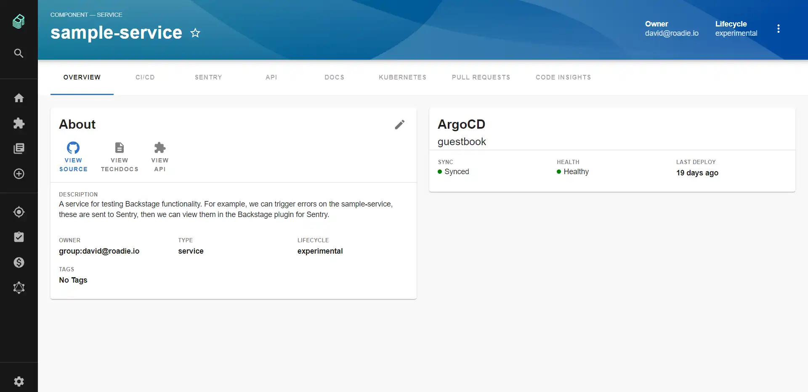
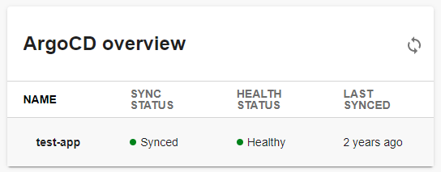
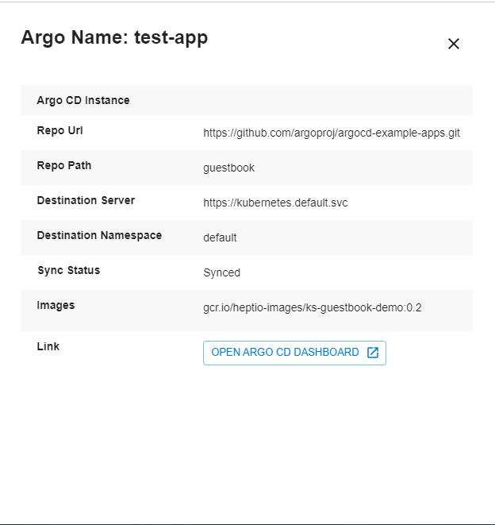
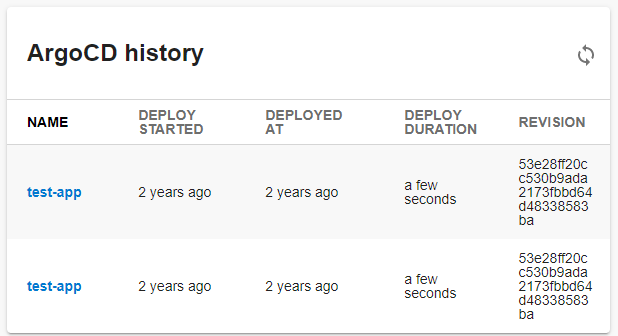

# Argo CD Plugin for Backstage



## Features

### 'ArgoCD overview' card



selected ArgoCD app details showing up after click on app name:



### 'ArgoCD history' card



## How to add argo-cd project dependency to Backstage app

If you have your own backstage application without this plugin, here it's how to add it:

1. In the `backstage/packages/app` project add the plugin as a `package.json` dependency:

```bash
yarn add @roadiehq/backstage-plugin-argo-cd
```

2. In the `app-config.yaml` file in the root directory, add argo-cd to the proxy object and optionally add the base url for your argoCD web UI:

```yml
proxy:
  ...

  '/argocd/api':
    # url to the api of your hosted argoCD instance
    target: https://159.65.209.132/api/v1/
    changeOrigin: true
    # this line is required if your hosted argoCD instance has self-signed certificate
    secure: false
    headers:
      Cookie:
        $env: ARGOCD_AUTH_TOKEN


# optional: this will link to your argoCD web UI for each argoCD application
argocd:
  baseUrl: https://my-argocd-web-ui.com
```

3. Add plugin to the list of plugins:

```ts
// packages/app/src/plugins.ts
export { argocdPlugin } from '@roadiehq/backstage-plugin-argo-cd';
```

4. Add plugin to the `entityPage.tsx` source file:

```ts
// packages/app/src/components/catalog/EntityPage.tsx
import {
  EntityArgoCDHistoryCard,
  isArgocdAvailable,
} from '@roadiehq/backstage-plugin-argo-cd';

const overviewContent = (
  <Grid container spacing={3} alignItems="stretch">
    ...
    <EntitySwitch>
      <EntitySwitch.Case if={e => Boolean(isArgocdAvailable(e))}>
        <Grid item sm={6}>
          <EntityArgoCDHistoryCard />
        </Grid>
      </EntitySwitch.Case>
    </EntitySwitch>
    ...
  </Grid>
);
```

## How to use Argo-cd plugin in Backstage

The Argo CD plugin is a part of the Backstage sample app. To start using it for your component, you have to:

1. Add an annotation to the YAML config file of a component. If there is only a single Argo CD application for the component, you can use

   ```yml
   argocd/app-name: <app-name>
   ```

   You can also use labels to select multiple Argo CD applications for a component:

   ```yml
   argocd/app-selector: <app-selector>
   ```

   **Note:** You can only use one of the options per component.

2. Add your auth key to the environmental variables for your backstage backend server (you can acquire it by sending a GET HTTP request to Argo CD's `/session` endpoint with username and password):
   ```
   ARGOCD_AUTH_TOKEN="argocd.token=<auth-token>"
   ```

## Support for multiple ArgoCD instances - Option 1

If you want to create multiple components that fetch data from different argoCD instances, you have to add a proxy config for each instance:

```yml
proxy:
  ...

  '/argocd/api':
    target: https://<someAddress>/api/v1/
    changeOrigin: true
    secure: false
    headers:
      Cookie:
        $env: ARGOCD_AUTH_TOKEN

  '/argocd/api2':
    target: https://<otherAddress>/api/v1/
    changeOrigin: true
    secure: false
    headers:
      Cookie:
        $env: ARGOCD_AUTH_TOKEN2
```

Add all required auth tokens to environmental variables, in this example, `ARGOCD_AUTH_TOKEN2`.

And then in the following component definition annotations add a line with the url to the desired proxy path:

```yml
argocd/proxy-url: '/argocd/api2'
```

`argocd/proxy-url` annotation defaults to '/argocd/api' so it's not needed if there is only one proxy config.

## Support for multiple Argo CD instances - Option 2 - Argo CD backend plugin

If you want to create multiple components that fetch data from different Argo CD instances, you can dynamically set the Argo CD instance url by adding the following to your app-config.yaml files.

The Argo plugin will fetch the Argo CD instances an app is deployed to and use the backstage-plugin-argo-cd-backend plugin to reach out to each Argo instance based on the mapping mentioned below.

Please visit the [Argo CD Backend Plugin](https://www.npmjs.com/package/@roadiehq/backstage-plugin-argo-cd-backend) for more information

## Support for apps in any namespace beta feature

If you want to use the "Applications in any namespace" beta [feature](https://argo-cd.readthedocs.io/en/stable/operator-manual/app-any-namespace/), you have to explicitly enable it in the configuration.

In the configuration file, you need to toggle the feature:

```yaml
argocd:
  ...
  namespacedApps: true
```

After enabling the feature, you can use the newly available `argocd/app-namespace` annotation on entities:

```yaml
metadata:
  annotations:
    argocd/app-namespace: my-test-ns
```

## Limit the number of revisions to load

The `ArgoCDHistoryCard` loads all app revisions by default. If your app has many revisions, this can lead to a lot of requests and long loading times. Therefore, you can limit the number of revisions to load in your configuration file:

```yaml
argocd:
  ...
  revisionsToLoad: 3
```

## Develop plugin locally

You can run the application by running `yarn dev` at the root of this monorepo.

You will need to perform the steps in the "How to use Argo-cd plugin in Backstage" section above.

You may also need to update the proxy target. The configuration in this repo defaults to localhost:8080.

To run the integration tests locally `yarn workspace app cy:dev` (assuming you have the application running).

## Links

- [Argo CD Backend Plugin](https://www.npmjs.com/package/@roadiehq/backstage-plugin-argo-cd-backend)
- [Backstage](https://backstage.io)
- Get hosted, managed Backstage for your company: https://roadie.io

---

Roadie gives you a hassle-free, fully customisable SaaS Backstage. Find out more here: [https://roadie.io](https://roadie.io).
