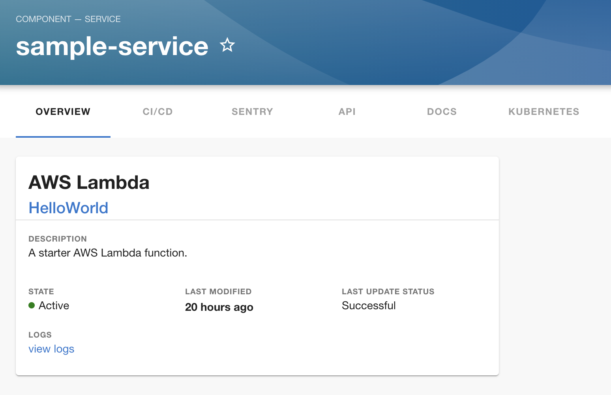

# AWS Lambda Plugin


## Features

- AWS Lambda function overview card


## Plugin Setup

1. Install the plugin in the `packages/app` directory

```bash
yarn add @roadiehq/backstage-plugin-aws-lambda
```

2. Add widget component to your Backstage instance:

```ts
// packages/app/src/components/catalog/EntityPage.tsx
import {
  EntityAWSLambdaOverviewCard,
  isAWSLambdaAvailable
} from '@roadiehq/backstage-plugin-aws-lambda';

...

const overviewContent = (
  <Grid container spacing={3} alignItems="stretch">
   <EntitySwitch>
      <EntitySwitch.Case if={e => Boolean(isAWSLambdaAvailable(e))}>
        <Grid item md={6}>
          <EntityAWSLambdaOverviewCard />
        </Grid>
      </EntitySwitch.Case>
   </EntitySwitch>
  </Grid>
);
```

## Authentication

In order to perform requests to AWS lambda plugin first asks backend for temporary credentials via /api/aws/credentials

(it uses @roadiehq/backstage-plugin-aws-auth backend plugin)

Regardless of what auth method you use - you can also decide what functions to show in the table (what functions particular service uses) by annotating backstage.yaml with name of the functions separated by comma, like:

```yaml
metadata:
  annotations:
    aws.com/lambda-function-name: HelloWorld
    aws.com/lambda-region: us-east-1
```

Make sure you have AWS auth backend plugin installed in your backstage backend (installation guide in the readme https://github.com/RoadieHQ/backstage-plugin-aws-auth)

## Links

- [Backstage](https://backstage.io)
- Get hosted, managed Backstage for your company: https://roadie.io
