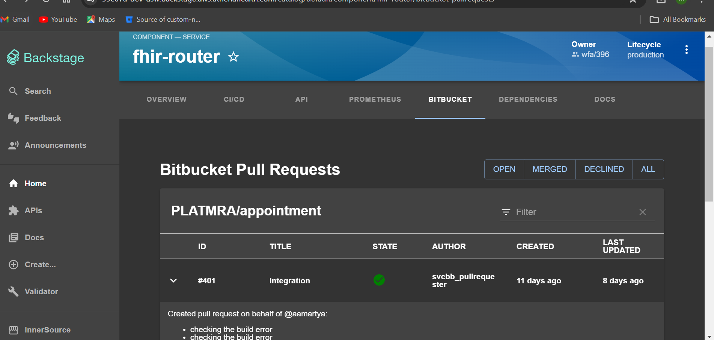

# ⚠️ Deprecated: Bitbucket PullRequest Plugin for Backstage

> **This plugin is deprecated in favor of the Backstage Community plugin: `@backstage-community/plugin-bitbucket-pull-requests`**

## Migration Guide

To migrate from `@roadiehq/backstage-plugin-bitbucket-pullrequest` to `@backstage-community/plugin-bitbucket-pull-requests`:

1. Uninstall the Roadie plugin:

   ```bash
   yarn remove @roadiehq/backstage-plugin-bitbucket-pullrequest
   ```

2. Install the Backstage Community plugin:

   ```bash
   yarn add @backstage-community/plugin-bitbucket-pull-requests
   ```

3. Update your imports in `packages/app/src/components/catalog/EntityPage.tsx`:

   ```diff
   - import { EntityBitbucketPullRequestsContent } from '@roadiehq/backstage-plugin-bitbucket-pullrequest';
   + import { EntityBitbucketPullRequestsContent } from '@backstage-community/plugin-bitbucket-pull-requests';
   ```

   No other changes are needed.

---

## (Legacy) Bitbucket PullRequest Plugin for Backstage



## Features

- List of PR's from particular bitbucket repo
- Filtering like OPEN/CLOSED/MERGED/ALL PR and Search
- Able to view Creator name, Created date and last update etc.
- We can go to Particular PR by clicking ID.

## How to add Bitbucket PR plugin to Backstage app

1. Install the plugin into Backstage.

```bash
cd packages/app
yarn add @roadiehq/backstage-plugin-bitbucket-pullrequest
```

2. Add plugin API to your Backstage instance.

```ts
// packages/app/src/components/catalog/EntityPage.tsx
import { EntityBitbucketPullRequestsContent } from '@roadiehq/backstage-plugin-bitbucket-pullrequest';

...

const serviceEntityPage = (
  <EntityLayout>
    ...
        <EntityLayout.Route path="/bitbucket-pullrequests" title="Bitbucket">
            <EntityBitbucketPullRequestsContent />
        </EntityLayout.Route>
    ...
  </EntityLayout>
```

3. Add proxy config

```yaml
// app-config.yaml
proxy:
  '/bitbucket/api':
    target: https://bitbucket.org
    changeOrigin: true
    headers:
      Authorization: Bearer ${BITBUCKET_TOKEN}
      Accept: 'application/json'
      Content-Type: 'application/json'
bitbucket:
  # Defaults to /bitbucket/api and can be omitted if proxy is configured for that url
  proxyPath: /bitbucket/api
```

4. Run backstage app with `yarn start` and navigate to services tabs.

## How to use Bitbucket PR plugin in Backstage

- Add annotation to the yaml config file of a component

```yaml
metadata:
  annotations:
    bitbucket.com/project-slug: <example-bitbucket-project-name>/<example-bitbucket-repo-name>
```

## Links

- [Backstage](https://backstage.io)
- Get hosted, managed Backstage for your company: https://roadie.io

---

Roadie gives you a hassle-free, fully customizable SaaS Backstage. Find out more here: [https://roadie.io](https://roadie.io).
