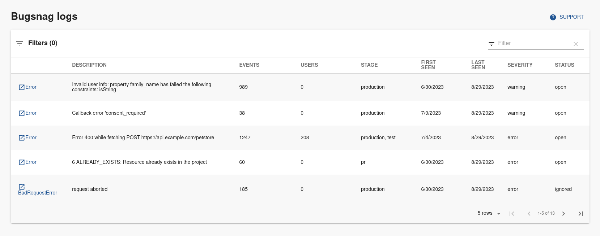

# Bugsnag Plugin for Backstage



## Rate Limit
Since Bugsnag has a policy around API rate limits (https://bugsnagapiv2.docs.apiary.io/#introduction/rate-limiting), we are not displaying error trends in the table. However, you can visit error details page in Bugsnag for more details, including error trend.

## Features

- Bugsnag plugin errors overview tab.

## How to add bugsnag project dependency to Backstage app:

If you have your own backstage application without this plugin, here it's how to add it:

1. Install the plugin inside `backstage/packages/app` :

```bash
cd packages/app
yarn add @roadiehq/backstage-plugin-bugsnag
```

2. In the `app-config.yaml` file in the root directory, add bugsnag to the proxy object:

```yml
proxy:
  ...
  '/bugsnag/api':
    target: 'https://api.bugsnag.com'
    headers:
        Authorization: 'token ${BUGSNAG_PERSONAL_TOKEN}'
        X-version: '2'
```

 Define number of results fetched per request (this is optional and if ommited it will be set to default value of 30). This will be used as a 'per_page' parameter (https://bugsnagapiv2.docs.apiary.io/#introduction/rate-limiting).

 ```yml
bugsnag:
  resultsPerPage: <number>
```

3. Add plugin to your Backstage instance:

```ts
// packages/app/src/components/catalog/EntityPage.tsx
import { EntityBugsnagErrorsOverviewTable } from '@roadiehq/backstage-plugin-bugsnag';
...

const serviceEntityPage = (
  <EntityLayoutWrapper>
    ...
    <EntityLayout.Route 
      path="/bugsnag"
      title="Bugsnag">
        <EntityBugsnagErrorsOverviewTable />
    </EntityLayout.Route>
    ...
  </EntityLayoutWrapper>
);
```

4. Run backstage app with `yarn start` and navigate to services tabs.

## How to use Bugsnag plugin in Backstage:

1. Add annotations to the yaml config file of a component:

```yml
bugsnag.com/project-key: <organization-name>/<project-notifier-api-key>
```

Please note that if your organisation has more projects than results returned by page and defined under 'bugsnag.resultsPerPage' you need to provide additional annotations where you will provide the name of the project:

```yml
bugsnag.com/project-name: <project-name>
```

These values can be found in Bugsnag settings dashboard, under organization and project settings.

2. Add your Bugsnag personal auth token to the environment variables of your backstage backend server (you can find it in https://app.bugsnag.com/settings/{organizationaname}/my-account/auth-tokens), in the form of the word 'token' followed by your token. So it should look like this:

   `BUGSNAG_PERSONAL_TOKEN="token <your-api-key>"`

## Links

- [Backstage](https://backstage.io)
- Get hosted, managed Backstage for your company: https://roadie.io
