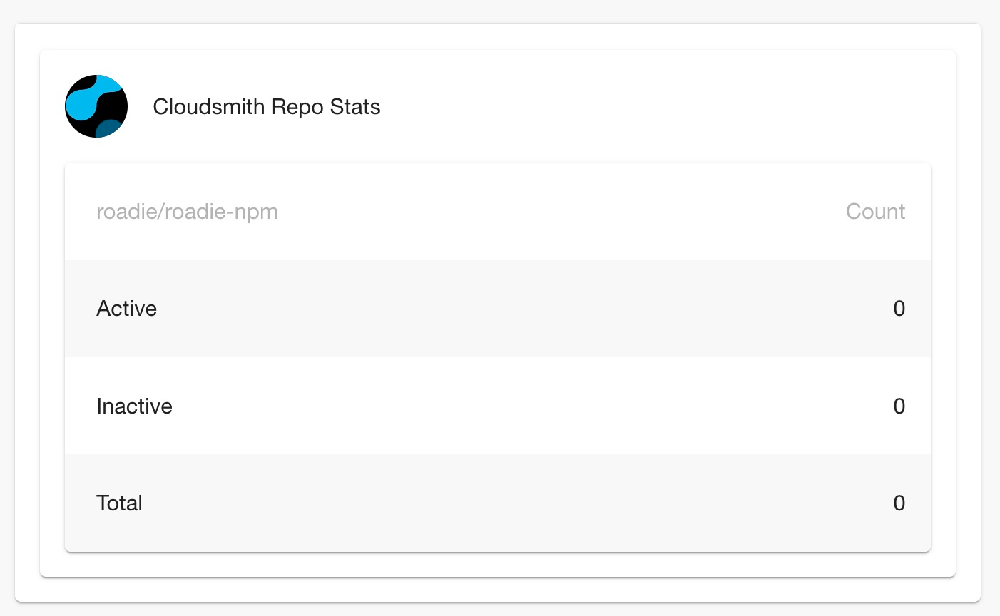

# backstage-plugin-cloudsmith

This plugin allows you to display statistics about a Cloudsmith repository to the homepage of Backstage.



To use this plugin, you will need to add the card to the home page in the frontend app and also set up a backend proxy for the

frontend plugin to communicate with Cloudsmith.

Cloudsmith hosts artifact repositories. Each repository is assigned an `owner` and a `repo` name when it is created. You will need

these values when you are configuring the homepage card. You will also need a [Cloudsmith API Key](https://help.cloudsmith.io/reference/authentication).

Edit the `packages/app/src/components/home/Homepage.tsx`.

Import the cloudsmith component:

```typescript jsx
import {
  CloudsmithStatsCard,
  CloudsmithQuotaCard,
  CloudsmithRepositoryAuditLogCard,
  CloudsmithRepositorySecurityCard,
} from '@roadiehq/backstage-plugin-cloudsmith';
```

Then add the component to the homepage content component, wherever you prefer.

```typescript jsx

<Grid  item  xs={12}  md={6}>
   <CloudsmithStatsCard  repo="repo-name"  owner="org-name"  />
</Grid>

<Grid  item  xs={12}  md={6}>
   <CloudsmithQuotaCard  owner='org-name'/>
</Grid>

<Grid  item  xs={12}  md={6}>
   <CloudsmithRepositoryAuditLogCard  owner='org-name'  repo='repo-name'/>
</Grid>

<Grid  item  xs={12}  md={6}>
   <CloudsmithRepositorySecurityCard  owner='org-name'  repo='repo-name'/>
</Grid>

```

Then you can edit the `app-config.yaml` for the backstage backend application, adding the following proxy configuration.

```yaml
...
proxy:
  ...
  '/cloudsmith':
    target: 'https://api.cloudsmith.io/v1'
    headers:
      X-Api-Key: ${CLOUDSMITH_API_KEY}
      User-Agent: 'Backstage'
```

When you run the backstage backend, you will need to set the `CLOUDSMITH_API_KEY` environment variable.
