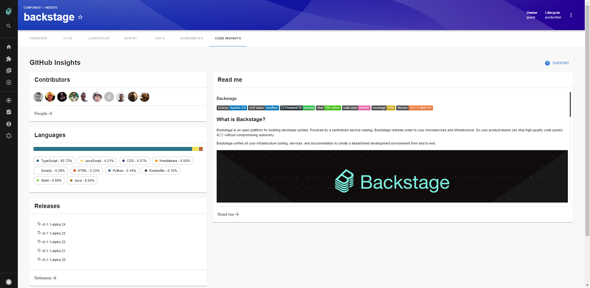
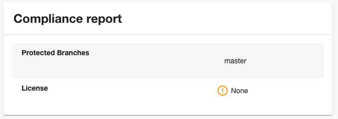
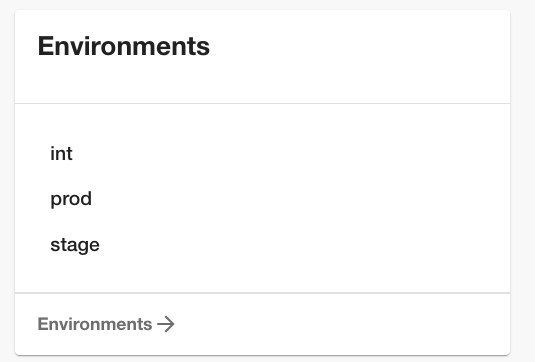

# GitHub Insights Plugin for Backstage



## Features

- Add GitHub Insights plugin tab.
- Show widgets about repository contributors, languages, readme, environments and release at overview page.

## Plugin Setup

1. Install the plugin:

```bash
cd packages/app
yarn add @roadiehq/backstage-plugin-github-insights
```

2. Add plugin API to your Backstage instance:

```ts
// packages/app/src/components/catalog/EntityPage.tsx
import { EntityGithubInsightsContent } from '@roadiehq/backstage-plugin-github-insights';

...

const serviceEntityPage = (
  <EntityLayoutWrapper>
    ...
    <EntityLayout.Route
      path="/code-insights"
      title="Code Insights">
      <EntityGithubInsightsContent />
    </EntityLayout.Route>
    ...
  </EntityLayoutWrapper>
);
```

3. Run backstage app with `yarn start` and navigate to services tabs.

## Widgets setup

1. You must install plugin by following the steps above to add widgets to your Overview. You might add only selected widgets or all of them.

2. Add widgets to your Overview tab:

```ts
// packages/app/src/components/catalog/EntityPage.tsx
import {
  EntityGithubInsightsContent,
  EntityGithubInsightsLanguagesCard,
  EntityGithubInsightsReadmeCard,
  EntityGithubInsightsReleasesCard,
  isGithubInsightsAvailable,
} from '@roadiehq/backstage-plugin-github-insights';

...

const overviewContent = (
  <Grid container spacing={3} alignItems="stretch">
   <EntitySwitch>
      <EntitySwitch.Case if={isGithubInsightsAvailable}>
        <Grid item md={6}>
          <EntityGithubInsightsLanguagesCard />
          <EntityGithubInsightsReleasesCard />
        </Grid>
        <Grid item md={6}>
          <EntityGithubInsightsReadmeCard maxHeight={350} />
        </Grid>
      </EntitySwitch.Case>
    </EntitySwitch>
  </Grid>
);

```

## Readme path

By default the plugin will use the annotation `github.com/project-slug` and get the root `README.md` from the repository. You can use a specific path by using the annotation `'github.com/project-readme-path': 'packages/sub-module/README.md'`. It can be useful if you have a component inside a monorepos.

### Widgets

#### Compliance Card

```ts
// packages/app/src/components/catalog/EntityPage.tsx
import { EntityGithubInsightsComplianceCard } from '@roadiehq/backstage-plugin-github-insights';
```



#### Contributors Card

```ts
// packages/app/src/components/catalog/EntityPage.tsx
import { EntityGithubInsightsContributorsCard } from '@roadiehq/backstage-plugin-github-insights';
```


#### Languages Card

```ts
// packages/app/src/components/catalog/EntityPage.tsx
import { EntityGithubInsightsLanguagesCard } from '@roadiehq/backstage-plugin-github-insights';
```


#### ReadMeCard

```ts
// packages/app/src/components/catalog/EntityPage.tsx
import { EntityGithubInsightsReadmeCard } from '@roadiehq/backstage-plugin-github-insights';
```


Please note that the [workflow status badge](https://docs.github.com/en/actions/monitoring-and-troubleshooting-workflows/adding-a-workflow-status-badge) feature in GitHub will not work with the Readme plugin.

#### ReleasesCard

```ts
// packages/app/src/components/catalog/EntityPage.tsx
import { EntityGithubInsightsReleasesCard } from '@roadiehq/backstage-plugin-github-insights';
```


#### EnvironmentsCard

```ts
// packages/app/src/components/catalog/EntityPage.tsx
import { EntityGithubInsightsEnvironmentsCard } from '@roadiehq/backstage-plugin-github-insights';
```



## New Frontend System

1. First, install the plugin into your app:

```bash
# From your Backstage root directory
yarn --cwd packages/app add @roadiehq/backstage-plugin-github-insights
```

2. If [feature discovery](https://backstage.io/docs/frontend-system/architecture/app/#feature-discovery) is enabled in your app, the plugin will be automatically discovered and added to the entity page. If not, you can manually add the plugin to your app:

```tsx
// packages/app/src/App.tsx
// ...
import githubInsightsPlugin from '@roadiehq/backstage-plugin-github-insights/alpha';

const app = createApp({
  features: [
    // ...
    githubInsightsPlugin,
  ],
});
```

3. If necessary, you can also customize the plugin:

```yaml
# app-config.yaml
app:
  # ...
  extensions:
    # ...
    - entity-card:github-insights/compliance:
        config:
          filter:
            kind: component
# ...
```

## Links

- [Backstage](https://backstage.io)
- Get hosted, managed Backstage for your company: https://roadie.io

---

Roadie gives you a hassle-free, fully customisable SaaS Backstage. Find out more here: [https://roadie.io](https://roadie.io).
