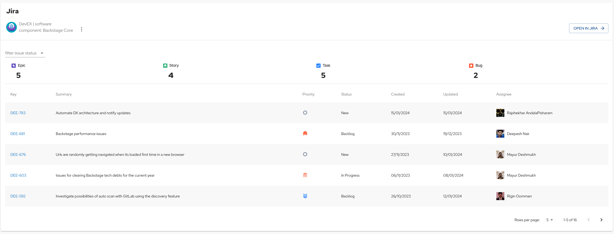
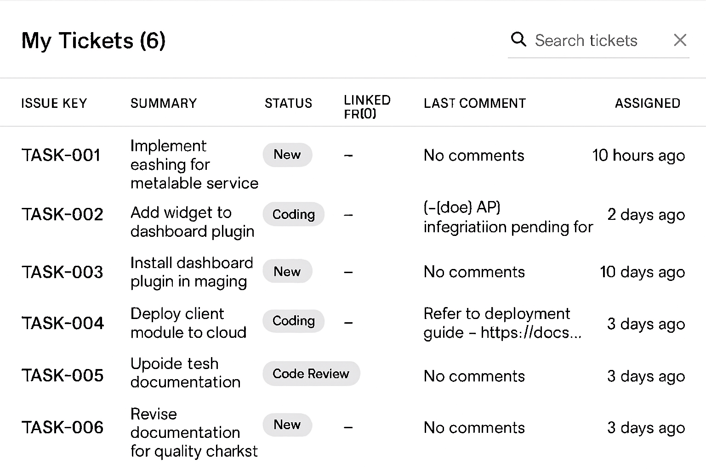

# Jira Plugin for Backstage

.
.

## Features

Entity Page components:

- EntityJiraOverviewCard
  - Show project details and tasks
  - View JIRA issues of the Project
  - Activity Stream
- EntityJiraActivityStreamCard
  - Activity Stream only
- EntityJiraQueryCard
  - Show results of a JQL query provided by annotation or props

Home Page components:

- HomePageMyJiraTicketsCard
  - Show my assigned JIRA tickets

## Feature Flags

This plugin supports the following feature flags:

- `jira-show-linked-prs`: Controls the visibility of linked pull requests column in the Jira tickets table
  - **Default**: Disabled
  - **Use case**: Enable this feature flag when using Jira Data Center, which supports the linked PRs API
  - **Note**: This feature is not available for Jira Cloud instances due to API limitations. If enabled with Jira Cloud, the column will still appear but will only show dashes ('-') since no PR data is available

To toggle this feature flag:

1. Go to the Backstage Settings page
2. Select the "Feature Flags" tab
3. Find the `jira-show-linked-prs` toggle and enable/disable it as needed
4. Refresh the page for changes to take effect
5. Navigate to the Home page to see the Jira tickets with/without the linked PRs column

## Annotations

- jira/component: A jira component name
  - Used by EntityJiraOverviewCard to filter by a single component
  - Can be used in JQL expressions used by EntityJiraQueryCard e.g. "component IN ({{ component }})"
- jira/project-key: a jira project key
  - Used by EntityJiraOverviewCard to get issues related to a single project
  - Can be used in JQL expressions used by EntityJiraQueryCard e.g. "project = ({{ project }})"
- jira/label: One or more jira labels
  - Used by EntityJiraOverviewCard to filter by labels. Use CSV to specify multiple labels.
  - Can be used in JQL expressions used by EntityJiraQueryCard e.g. "label IN ({{ label }})"
- jira/team: the ID of a Jira team
  - Can be used in JQL expressions used by EntityJiraQueryCard e.g. "'Team[Team]' = '{{ team }}'"

## How to add Jira project dependency to Backstage app

1. If you have standalone app (i.e., you didn't clone this repo), then do

```bash
cd packages/app
yarn add @roadiehq/backstage-plugin-jira
```

2. Add proxy config:

```yaml
# app-config.yaml
proxy:
  '/jira/api':
    target: <JIRA_URL>
    headers:
      Authorization: ${JIRA_TOKEN}
      Accept: 'application/json'
      Content-Type: 'application/json'
      X-Atlassian-Token: 'no-check'
      # This is a workaround since Jira APIs reject browser origin requests. Any dummy string without whitespace works.
      User-Agent: 'AnyRandomString'

jira:
  # Defaults to /jira/api and can be omitted if proxy is configured for that url
  proxyPath: /jira/api
  # Add it in case your JIRA instance is connected to Confluence, in order to filter those activities
  confluenceActivityFilter: wiki@uuid
  # Defaults to latest and can be omitted if you want to use the latest version of the api
  apiVersion: latest
  # Defaults to `cloud`, but also supports `datacenter`
  product: cloud
```

3. Set img-src in Content Security Policy

```yaml
# app-config.yaml
backend:
  # ...
  csp:
    img-src:
      # "'self'" and 'data' are from the backstage default but must be set since img-src is overriden
      - "'self'"
      - 'data:'
      # Allow your Jira instance for @roadiehq/backstage-plugin-jira
      - 'JIRA_URL'
```

4. Add plugin component to your Backstage instance:

```jsx
// packages/app/src/components/catalog/EntityPage.tsx
import {
  EntityJiraOverviewCard,
  isJiraAvailable,
} from '@roadiehq/backstage-plugin-jira';

const overviewContent = (
  <Grid container spacing={3} alignItems="stretch">
    ...
    <EntitySwitch>
      <EntitySwitch.Case if={isJiraAvailable}>
        <Grid item md={6}>
          <EntityJiraOverviewCard />
        </Grid>
      </EntitySwitch.Case>
    </EntitySwitch>
  </Grid>
);
```

## How to get the Confluence Activity Filter key

To filter the Confluence activities your instance needs to have the filter to select one or more types of activity from Confluence. You can check that out by executing the following command in your bash:

```bash
curl -s -H "Authorization: <TOKEN>" <JIRA_URL>/rest/activity-stream/1.0/config | jq .
```

Then, check for a Confluence filter and copy the `key` value into the tag `jira.confluenceActivityFilter` in your Backstage's `app-config.yaml`.

## How to use Jira plugin in Backstage

1. Add annotation to the yaml config file of a component:

```yaml
metadata:
  annotations:
    jira/project-key: <example-jira-project-key>
    jira/component: <example-component> # optional, you might skip value to fetch data for all components
    jira/label: <example-label> # optional, you might skip value to fetch data for all labels
    jira/token-type: Bearer # optional, used for Activity stream feed. If you are using Basic auth you can skip this.
```

Even though you can use Bearer token please keep in mind that Activity stream feed will only contain entries that are visible to anonymous users. In order to view restricted content you will need to authenticate via Basic authentication, as described in official documentation (https://developer.atlassian.com/server/framework/atlassian-sdk/consuming-an-activity-streams-feed/#authentication).

2. Get and provide `JIRA_TOKEN` as env variable:

   1. Obtain your personal token from Jira: https://id.atlassian.com/manage-profile/security/api-tokens
   2. Create a base64-encoded string by converting "your-atlassian-account-mail:your-jira-token",

      ```
      // node
      new Buffer('jira-mail@example.com:hTBgqVcrcxRYpT5TCzTA9C0F').toString(
        'base64',
      );

      // in your browser console
      btoa('jira-mail@example.com:hTBgqVcrcxRYpT5TCzTA9C0F');

      // bash
      echo -n 'jira-mail@example.com:hTBgqVcrcxRYpT5TCzTA9C0F' | base64
      ```

      for example `jira-mail@example.com:hTBgqVcrcxRYpT5TCzTA9C0F` converts to `amlyYS1tYWlsQGV4YW1wbGUuY29tOmhUQmdxVmNyY3hSWXBUNVRDelRBOUMwRg==`

   3. Save the environmental variable `JIRA_TOKEN` with `Basic ` prefix, eg: `JIRA_TOKEN='Basic amlyYS1tYWlsQGV4YW1wbGUuY29tOmhUQmdxVmNyY3hSWXBUNVRDelRBOUMwRg=='`

## Add Homepage components to your home page

The `HomePageMyJiraTicketsCard` component displays the Open and In Progress JIRA tickets that are assigned to the provided `userId`.


To add the component to your Homepage:

```jsx
//packages/app/src/components/home/HomePage.tsx

import { HomePageMyJiraTicketsCard } from '@roadiehq/backstage-plugin-jira';

export const HomePage = () => {
  return (
    // ...
    <Grid item md={6} xs={12}>
      <HomePageMyJiraTicketsCard userId="roadie" />
    </Grid>
    // ...
  );
};
```

## Links

- [Backstage](https://backstage.io)
- Get hosted, managed Backstage for your company: https://roadie.io

---

Roadie gives you a hassle-free, fully customisable SaaS Backstage. Find out more here: [https://roadie.io](https://roadie.io).
