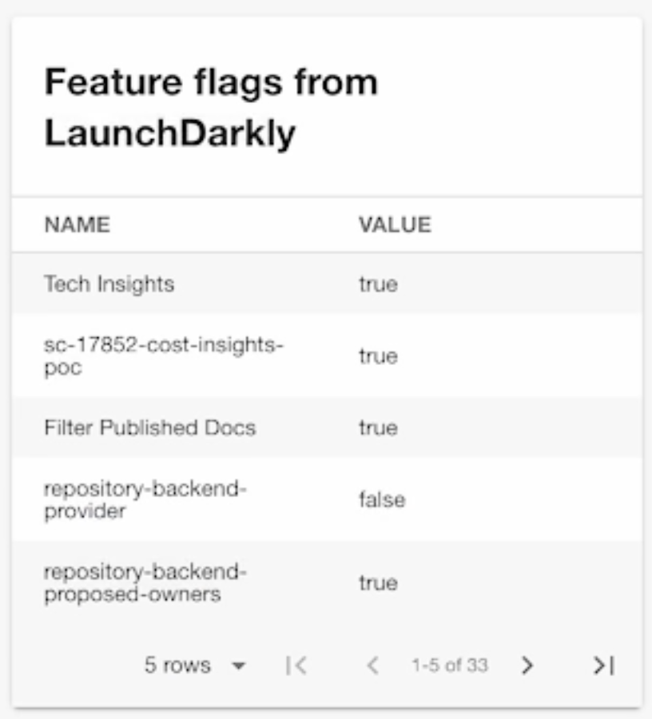

# LaunchDarkly

Welcome to the LaunchDarkly plugin! It allows you to view feature flags on an entity page in Backstage for either a Project in a tab or a specific context in an entity card.



## Getting started

Add a proxy configuration for LaunchDarkly in the `app-config.yaml` file

```yaml
proxy:
  '/launchdarkly/api':
    target: https://app.launchdarkly.com/api
    headers:
      Authorization: ${LAUNCHDARKLY_API_KEY}
```

### EntityLaunchdarklyContextOverviewCard

In the `packages/app/src/components/catalog/EntityPage.tsx` under `overviewContent` add the following:

```jsx
<EntitySwitch>
  <EntitySwitch.Case if={isLaunchdarklyContextAvailable}>
    <EntityLaunchdarklyContextOverviewCard />
  </EntitySwitch.Case>
</EntitySwitch>
```

### EntityLaunchdarklyCard

This component displays LaunchDarkly flags with multiple environments. It allows toggling which columns are shown and provides a more comprehensive view of LaunchDarkly flags. The component expects a prop array of envs to display on the table.

In the `packages/app/src/components/catalog/EntityPage.tsx` under `overviewContent` add the following:

```jsx
<EntitySwitch>
  <EntitySwitch.Case if={isLaunchdarklyProjectAvailable}>
    <EntityLaunchdarklyCard envs={['production', 'dev']} />
  </EntitySwitch.Case>
</EntitySwitch>
```

Features:

- Displays flags with status for multiple environments
- Allows toggling which columns are shown (Name, Key, Description, Tags, Variations)
- Allows toggling which environments are shown
- Provides hyperlinks to flags via the flag names
- Includes flag keys and descriptions
- Has an expandable section for additional details

### EntityLaunchdarklyProjectOverviewContent

In the `packages/app/src/components/catalog/EntityPage.tsx` under `serviceEntityPage` add the following:

```jsx
<EntityLayout.Route path="/launch-darkly-projects" title="LaunchDarkly">
  <EntityLaunchdarklyProjectOverviewContent />
</EntityLayout.Route>
```

Set the `LAUNCHDARKLY_API_KEY` environment variable and run the backstage backend.

Create an entity with the following annotations and import it:

```yaml
---
apiVersion: backstage.io/v1alpha1
kind: Component
metadata:
  name: launchdarklytest
  annotations:
    launchdarkly.com/project-key: default
    launchdarkly.com/environment-key: test
    launchdarkly.com/context: '{ "kind": "tenant", "key": "blah", "name": "blah" }'
spec:
  type: service
  lifecycle: unknown
  owner: 'group:engineering'
```

### Filtering flags

Add the additional annotations in order to filter flags by tags and/or query

```yaml
---
apiVersion: backstage.io/v1alpha1
kind: Component
metadata:
  name: launchdarklytest
  annotations:
    launchdarkly.com/project-key: default
    launchdarkly.com/environment-key: test
    launchdarkly.com/context: '{ "kind": "tenant", "key": "blah", "name": "blah" }'
    launchdarkly.com/filter-tags: '["tagged-flag"]'
    launchdarkly.com/filter-query: 'dark-mode'
spec:
  type: service
  lifecycle: unknown
  owner: 'group:engineering'
```

---

Roadie gives you a hassle-free, fully customisable SaaS Backstage. Find out more here: [https://roadie.io](https://roadie.io).
