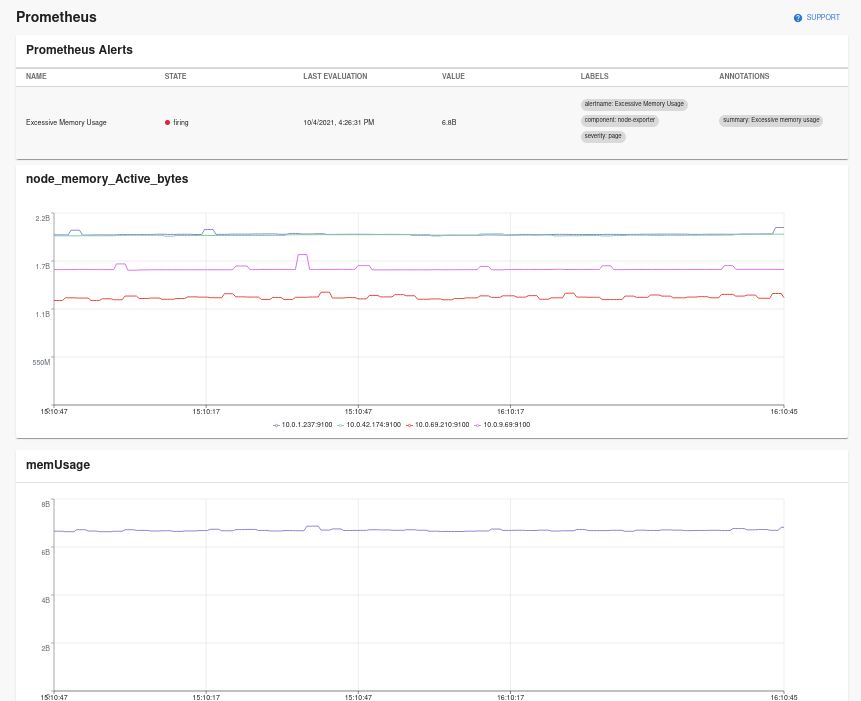
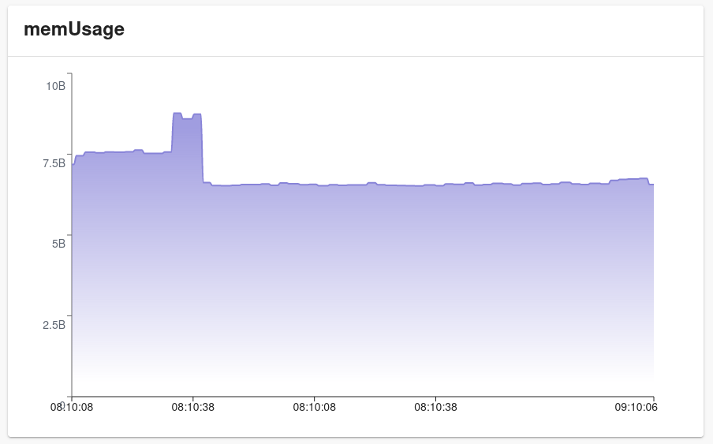
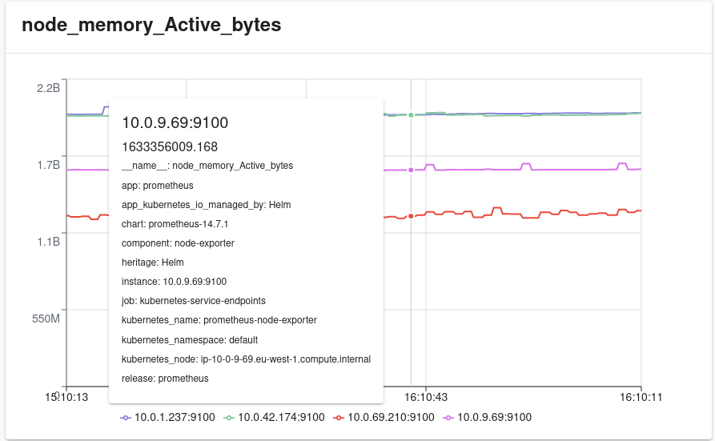
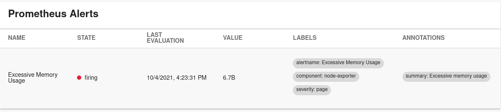
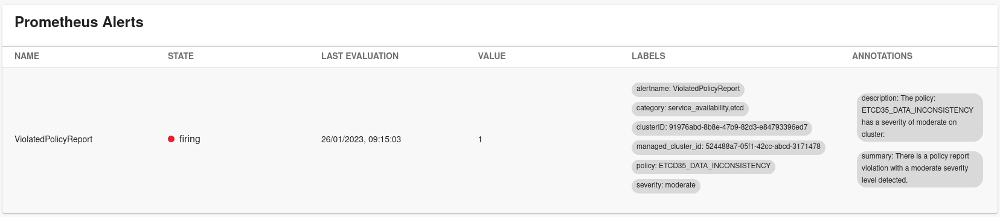

# Backstage Plugin Prometheus

Backstage plugin exposing graphs and alerts from Prometheus



### The plugin provides an entity content page and two additional widgets:

1. Alert table widget
2. Prometheus Graph widget

- Graph widget has two versions, line graph and an area graph

## Configuring

This plugin expects you to have Prometheus running with its API available to be called from Backstage.

## Install the plugin

```bash
cd packages/app
yarn add @roadiehq/backstage-plugin-prometheus
```

## Configure proxy for Prometheus

```yaml
# app.config.yaml

proxy:
  '/prometheus/api':
    # url to the api and path of your hosted prometheus instance
    target: http://localhost:9090/api/v1/
    changeOrigin: true
    secure: false
    headers:
      Authorization: $YOUR_AUTH_TOKEN_IF_PROMETHEUS_IS_SECURED

# Defaults to /prometheus/api and can be omitted if proxy is configured for that url
prometheus:
  proxyPath: /prometheus/api
  uiUrl: http://localhost:9090
```

## Content page setup

```ts
// packages/app/src/components/catalog/EntityPage.tsx
import {
  EntityPrometheusContent,
} from '@roadiehq/backstage-plugin-prometheus';
...

const serviceEntityPage = (
  <EntityLayout>
    ...
    <EntityLayout.Route path="/prometheus" title="Prometheus">
      <EntityPrometheusContent />
    </EntityLayout.Route>
    ...
  </EntityLayout>
```

## Widget

1. Install plugin by following the steps above to add widget to your Overview

2. Add widgets to your Overview tab:

```ts
// packages/app/src/components/catalog/EntityPage.tsx
import {
  EntityPrometheusAlertCard,
  EntityPrometheusGraphCard,
  isPrometheusAvailable
} from '@roadiehq/backstage-plugin-prometheus';

...

const overviewContent = (
  <Grid container spacing={3}>
    ...
    <EntitySwitch>
      <EntitySwitch.Case if={isPrometheusAvailable}>
        <Grid item md={8}>
          <EntityPrometheusAlertCard />
        </Grid>
        <Grid item md={6}>
          <EntityPrometheusGraphCard />
        </Grid>
      </EntitySwitch.Case>
    </EntitySwitch>
    ...
  </Grid>
);

```

See table customisation steps below for extra context of available customisation.

## Entity annotations

The plugin uses entity annotations to determine what data to display. There are two different annotations that can be used:

1. Rule annotation to visualize [Prometheus recording rules](https://prometheus.io/docs/prometheus/latest/configuration/recording_rules/) and queries
2. Alert annotation to display [Prometheus alerting rule](https://prometheus.io/docs/prometheus/latest/configuration/alerting_rules/) in a table format.

### Graphs

#### `prometheus.io/rule`

The 'rule' annotation expects a comma separated list of queries or recording rules and grouping dimension tuples. Dimension is optional and can be omitted which leads to the first label found from the returned data set to be used as the key to group items with.

The annotation supports individual metrics, promQL queries or references to a name of a recording rule. For complex queries a recording rule is the preferred option, since annotation parsing prevents to usage of characters `,` and `|` in queries.

Example annotation
`prometheus.io/rule: memUsage|component,node_memory_active_bytes|instance,sum by (instance) (node_cpu_seconds_total)`

Produces the following graphs:

1. `memUsage|component`
   (grouping by component, otherwise `__name__` would be the first item on this saved rule. Showed here as an area graph)
   

2. `node_memory_active_bytes|instance`
   (grouping by `instance`, image shows extra data on hover over a line.)
   

3. `sum by (instance) (node_cpu_seconds_total)`
   (`instance` is the grouper label defined in the query --> it is returned on the result set as the first label name, and is therefore used to group data with.)
   

### Alerts

#### `prometheus.io/alert`

The 'alert' annotation expects a comma separated list of predefined alert names from the Prometheus server. These are iterated and displayed in a table, displaying state, value, labels, evaluation time and annotations. Each row represents an affected target (labelset), so the same alert name can appear multiple times when multiple pods/instances are affected. To display all alerts configured in Prometheus a magic annotation `prometheus.io/alert: all` can be used.

Example annotation
`prometheus.io/alert: 'Excessive Memory Usage'` produces the following table.


#### `prometheus.io/labels`

The 'labels' annotation expects a comma-separated list of labels and values. The plugin displays alerts that contain all these labels. This label is optional and requires `prometheus.io/alert` annotation to be present. If `prometheus.io/labels` is not defined, alerts are not filtered by labels.

Example annotation
`prometheus.io/labels: "managed_cluster_id=524488a7-05f1-42cc-abcd-3171478"` produces the following table.


## Custom Graphs and Tables

For more customisability the package exports both `PrometheusGraph` and `PrometheusAlertStatus` as individual components. It is possible to create more customized graphs and/or tables using these directly by dynamically constructing props that these component are expecting.

Type definition for `PrometheusGraph` props is:

```typescript
{
   query: string;
   range ? : {
      hours? : number;
      minutes? : number;
   };
   step ? : number;
   dimension ? : string;
   graphType ? : 'line' | 'area';
}
```

Type definition for `PrometheusAlertStatus' props is:

```typescript
{
  alerts: string[] | 'all';
  extraColumns?: TableColumn<PrometheusDisplayableAlert>[];
  showAnnotations?: boolean;
  showLabels?: boolean;
  showInactiveAlerts?: boolean;
}
```

example for extra alerts table columns:

```typescript
const extraColumns: TableColumn<PrometheusDisplayableAlert>[] = [
  {
    title: 'Summary',
    field: 'annotations.summary',
  },
  {
    title: 'Description',
    field: 'annotations.description',
  },
];
```

### Showing Inactive Alerts

By default, the plugin only displays alerts that are actively firing or pending. To also show configured alerts that are in an inactive state (not currently firing), you can use the `showInactiveAlerts` prop:

```typescript
<EntityPrometheusAlertCard showInactiveAlerts={true} />
```

Or when using the component directly:

```typescript
<PrometheusAlertStatus alerts="all" showInactiveAlerts={true} />
```

Inactive alerts will be displayed with a green "inactive" status indicator, showing they are configured but not currently triggering. This is useful for viewing all configured alerts for a service, including those that are currently passing.

## Multiple Prometheus instances

If you have multiple Prometheus instances you can use the annotation `prometheus.io/service-name`
, which has to match an instance at your Backstage configuration.

```yaml
proxy:
  '/prometheus/api':
    target: http://localhost:9090/api/v1/
  '/prometheusTeamB/api':
    target: http://localhost:9999/api/v1/

prometheus:
  proxyPath: /prometheus/api
  uiUrl: http://localhost:9090
  instances:
    - name: prometheusTeamB
      proxyPath: /prometheusTeamB/api
      uiUrl: http://localhost:9999
```

## Advanced Dynamic Prometheus Proxying

If you have a very large amount of prometheus servers, the above statically configured "Multiple Prometheus instances" proxy config may become verbose and difficult to maintain. You can take full control over Backstage's backend proxying behavior for prometheus by writing your own proxy middleware.

All prometheus requests from the frontend will send the entities `prometheus.io/service-name` annotation in the `x-prometheus-service-name` request header.

Step 1: Update app-config to use a special path if it can't find the `prometheus.io/service-name` config in the `prometheus.instances` config array
**app-config.yaml**

```yaml
prometheus:
  proxyPath: '/dynamic-prometheus'
```

Step 2: Hijack this path by writing your own proxy middleware extension.
**packages/backend/src/plugins/proxy.ts**

```diff
import { createRouter } from '@backstage/plugin-proxy-backend';
import { Router } from 'express';
import { PluginEnvironment } from '../types';
+ import { createProxyMiddleware } from 'http-proxy-middleware';

export default async function createPlugin(
  env: PluginEnvironment,
): Promise<Router> {
  const proxyRouter = await createRouter({
    logger: env.logger,
    config: env.config,
    discovery: env.discovery,
  });
+ const externalUrl = await env.discovery.getExternalBaseUrl('proxy');
+ const { pathname: pathPrefix } = new URL(externalUrl);
+ proxyRouter.use(
+   '/dynamic-prometheus',
+   createProxyMiddleware({
+     logProvider: () => env.logger,
+     logLevel: 'debug',
+     changeOrigin: true,
+     pathRewrite: {
+       [`^${pathPrefix}/dynamic-prometheus/?`]: '/',
+     },
+     // Some code that does something with the x-prometheus-service-name header.
+     // Here you can just do URL manipulation, or even make requests out to other services
+     // or caches to pull down lookup info.
+     router: async (req) => {
+       const prometheusServiceName = req.headers['x-prometheus-service-name'];
+       return `https://${prometheusServiceName}.company.com`;
+     },
+   }),
+ );
+ return proxyRouter;
```

## Using callback with `EntityPrometheusAlertCard`

You can add callbacks that will be executed when the user clicks on a row in the table of the `EntityPrometheusAlertCard` component. This callback is optional, and the rows become clickable only when the callback is supplied. The callback function is also provided with data of type JSON. It contains the information from the row of the table.
The component with callback can look like this:

```typescript
<EntityPrometheusAlertCard onRowClick={callbackFunction} />
```

Where `callbackFunction` can have the following definition:

```typescript
const callbackFunction = (arg: Alerts) => {
  ...
};
```

`Alerts` is a custom type you can define to easily parse JSON (or you can use `any` type).

## Links

- [Backstage](https://backstage.io)
- [Prometheus](https://prometheus.io/docs/introduction/overview/)
- [Prometheus Recording Rules](https://prometheus.io/docs/prometheus/latest/configuration/recording_rules/)
- Get hosted, managed Backstage for your company: https://roadie.io

---

Roadie gives you a hassle-free, fully customisable SaaS Backstage. Find out more here: [https://roadie.io](https://roadie.io).
