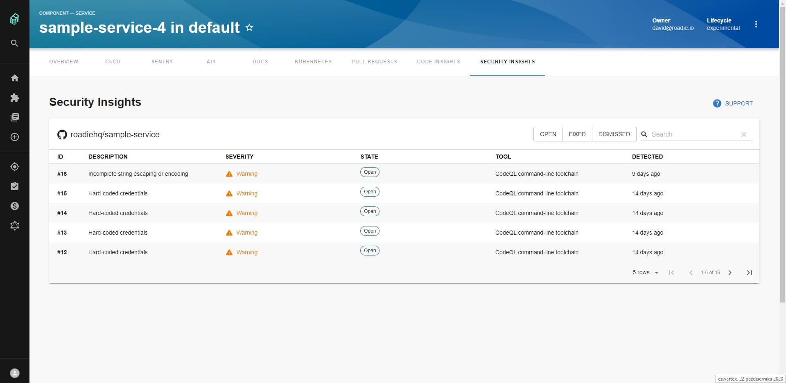
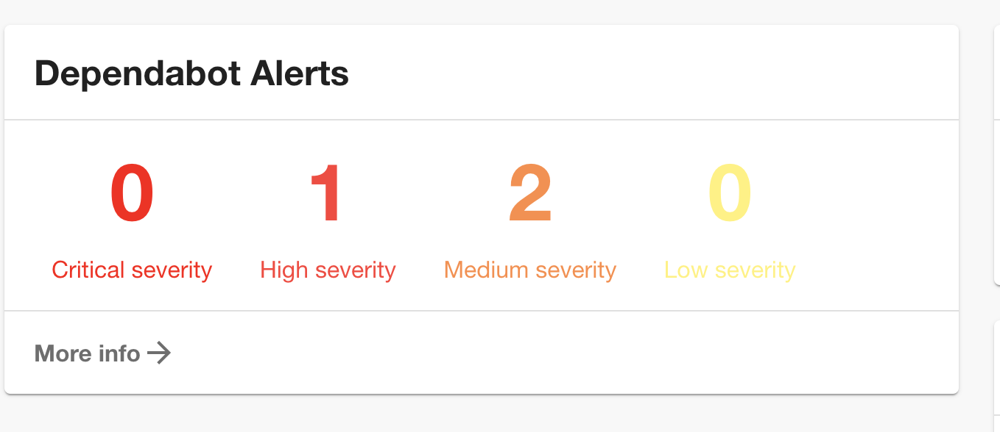

# GitHub Security Insights Plugin for Backstage




## Features

- List detected vulnerabilities for your repository, with filtering and search.
- Show statistics widget about detected vulnerabilities for your repository.
## Plugin Setup

1. If you have standalone app (you didn't clone this repo), then in the [packages/app](https://github.com/backstage/backstage/blob/master/packages/app/) directory of your backstage instance, add the plugin as a package.json dependency:

```bash
yarn add @roadiehq/backstage-plugin-security-insights
```

2. Import the plugin to the [entityPage.tsx](https://github.com/backstage/backstage/blob/master/packages/app/src/components/catalog/EntityPage.tsx) source file:

```tsx
import {
  EntitySecurityInsightsContent,
  isSecurityInsightsAvailable
} from '@roadiehq/backstage-plugin-security-insights';


const serviceEntityPage = (
  <EntityPageLayout>
    ...
    <EntityLayout.Route
      path="/security-insights"
      title="Security Insights"
      // Uncomment the line below if you'd like to only show the tab on entities with the correct annotations already set
      // if={isSecurityInsightsAvailable}
      >
      <EntitySecurityInsightsContent />
    </EntityLayout.Route>
    ...
  </EntityPageLayout>
)
```

3. If you want to show dependabot alerts on your Backstage instance, make sure to import following code to the [entityPage.tsx](https://github.com/backstage/backstage/blob/master/packages/app/src/components/catalog/EntityPage.tsx) source file:

```tsx
import {
  EntityGithubDependabotContent,
  isSecurityInsightsAvailable
} from '@roadiehq/backstage-plugin-security-insights';


const serviceEntityPage = (
  <EntityPageLayout>
    ...
    <EntityLayout.Route 
      path="/dependabot" 
      title="Dependabot"
      // Uncomment the line below if you'd like to only show the tab on entities with the correct annotations already set
      // if={isSecurityInsightsAvailable}
      >
      <EntityGithubDependabotContent/>
    </EntityLayout.Route>
    ...
  </EntityPageLayout>
)
```

4. Run backstage app with `yarn start` and navigate to services tabs.

## Widget setup




1. You must install plugin by following the steps above to add widgets to your Overview.

2. Add security insights widget to your Overview tab:

```ts
// packages/app/src/components/catalog/EntityPage.tsx
import {
  SecurityInsightsWidget,
  isSecurityInsightsAvailable,
} from '@roadiehq/backstage-plugin-security-insights';

...
const overviewContent = (
  <Grid container spacing={3} alignItems="stretch">
    ...
    <EntitySwitch>
      <EntitySwitch.Case if={isSecurityInsightsAvailable}>
        <Grid item md={6}>
          <SecurityInsightsWidget/>
        </Grid>
      </EntitySwitch.Case>
    </EntitySwitch>
    ...
  </Grid>
);

```

3. Add dependabot alerts widget to your Overview tab:

```ts
// packages/app/src/components/catalog/EntityPage.tsx
import {
  DependabotAlertsWidget,
  isSecurityInsightsAvailable,
} from '@roadiehq/backstage-plugin-security-insights';

...
const overviewContent = (
  <Grid container spacing={3} alignItems="stretch">
    ...
    <EntitySwitch>
      <EntitySwitch.Case if={isSecurityInsightsAvailable}>
        <Grid item md={6}>
          <DependabotAlertsWidget />
        </Grid>
      </EntitySwitch.Case>
    </EntitySwitch>
    ...
  </Grid>
);

```
4. Per default, all severity level alerts will be included and shown on the widget. However, severity level for dependabot alerts shown in Dependabot alerts widget is configurable via app-config. For example, if you want to show only high and medium severity alerts, you can do it in the following way.

```yaml
// app-config.yaml
dependabotAlertsConfiguration: 
  severity: [ high, medium]
``` 


## Links

- [Backstage](https://backstage.io)
- Get hosted, managed Backstage for your company: https://roadie.io
