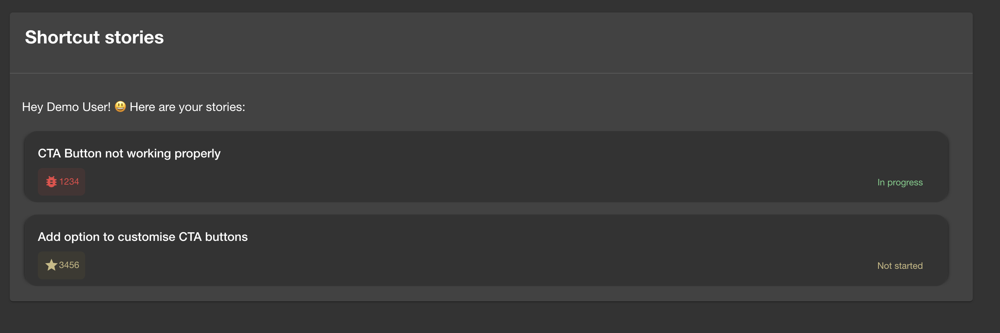

# Shortcut Plugin for Backstage



This plugin provides overview of user stories which are not yet completed but are assigned to a user. In order to retrieve stories you will need to sign in to Backstage using same email address used for Shortcut account.

## Rate Limit

The Shortcut REST API limits requests to 200 per minute. Any requests over that limit will not be processed, and will return a 429 (“Too Many Requests”) response code.

## Authentication

The Shortcut API uses token-based authentication so in order to retrieve results you will need it. To generate an API token, go to https://app.shortcut.com/settings/account/api-tokens.

## Features

- Shortcut stories progress overview.

## How to add shortcut plugin to Backstage app:

If you have your own backstage application without this plugin, here it's how to add it:

1. Install the plugin inside `backstage/packages/app` :

```bash
cd packages/app
yarn add @roadiehq/backstage-plugin-shortcut
```

2. In the `app-config.yaml` file in the root directory, add shortcut to the proxy object:

```yml
proxy:
  ...
  '/shortcut/api':
    target: https://api.app.shortcut.com/api/v3
    headers:
      Shortcut-Token: '${SHORTCUT_API_TOKEN}'
```

3. Add plugin to your Backstage instance:

```ts
// packages/app/src/components/catalog/EntityPage.tsx
import { EntityShorcutPageContent } from '@roadiehq/backstage-plugin-shortcut';
...

const userPage = (
  <EntityLayoutWrapper>
    ...
    <EntityLayout.Route path="/backstage-plugin-shortcut" title="Shortcut">
      <EntityShorcutPageContent />
    </EntityLayout.Route>
    ...
  </EntityLayoutWrapper>
);
```

4. Run backstage app with `yarn start` and navigate to user tab.

## How to add Shortcut stories card to Home page:

In order to add the Shortcut storied card in your Home page, follow the instructions below:

```ts
// packages/app/src/components/home/HomePage.tsx
import { StoriesCard } from '@roadiehq/backstage-plugin-shortcut';
...

export const HomePage = () => {
  <PageWithHeader title="Home" themeId="home">
    <Content>
    ...
        <Grid item md={6} xs={12}>
            <StoriesCard />
        </Grid>
    ...
    </Content>
  </PageWithHeader>
);
```

## How to use Shortcut plugin in Backstage:

1. Add your Shorcut personal auth token to the environment variables of your backstage backend server (you can find it in https://app.shortcut.com/larder/settings/account/api-tokens), in the end it should look like this:

   `SHORTCUT_API_TOKEN="YOUR_API_TOKEN"`

## Links

- [Backstage](https://backstage.io)
- Get hosted, managed Backstage for your company: https://roadie.io
