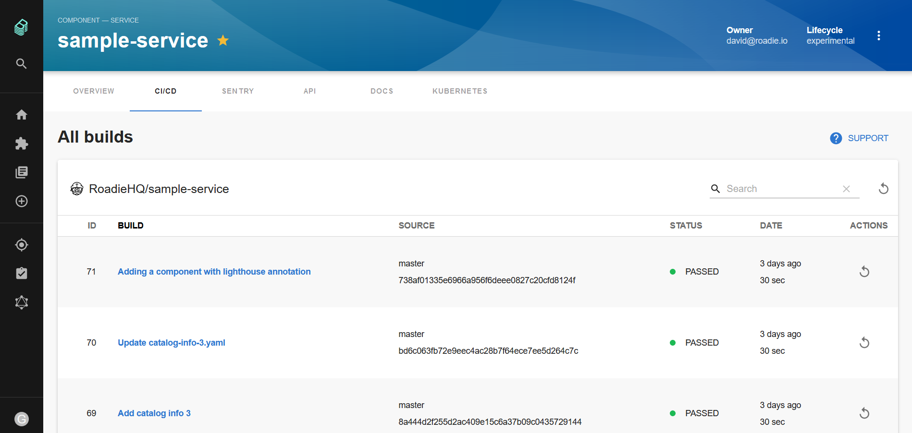

# Travis CI Plugin for Backstage



## Features

- List Travis CI Builds
- Retrigger builds

## How to add Travis-ci project dependency to Backstage app

If you have your own backstage application without this plugin, here are instructions how to add it:

1. In the `backstage/packages/app` project add the plugin as a `package.json` dependency:

```bash
yarn add @roadiehq/backstage-plugin-travis-ci
```

2. add configuration in `app-config.yaml` file in the root directory:

In the proxy object: 
```yml
proxy:

  ...

  '/travisci/api':
    target: https://api.travis-ci.com
    changeOrigin: true
    headers:
      Authorization: ${TRAVISCI_AUTH_TOKEN}
      travis-api-version: 3
```

and as a separate configuration object:
```yml
travisci:
  baseUrl: 'https://travis-ci.com/'
```

3. Import it into your Backstage application:

```ts
// packages/app/src/components/catalog/EntityPage.tsx
import {
  EntityTravisCIContent,
  EntityTravisCIOverviewCard,
  isTravisciAvailable,
} from '@roadiehq/backstage-plugin-travis-ci';
```

4. Add plugin to the `EntityPage.tsx` source file:

```tsx
// packages/app/src/components/catalog/EntityPage.tsx
export const cicdContent = (
  <EntitySwitch>
    <EntitySwitch.Case if={isTravisciAvailable}>
      <EntityTravisCIContent />
    </EntitySwitch.Case>
    ...
  </EntitySwitch>
);
```

5. Add a recent Travis-CI builds widget/card to the overview tab to the [entityPage.tsx](https://github.com/backstage/backstage/blob/master/packages/app/src/components/catalog/EntityPage.tsx) source file:

```tsx
export const cicdCard = (
  <EntitySwitch>
    <EntitySwitch.Case if={isTravisciAvailable}>
        <Grid item sm={6}>
          <EntityTravisCIOverviewCard />
        </Grid>
    </EntitySwitch.Case>
  </EntitySwitch>
);

```

## How to use Travis-ci plugin in Backstage

Travis-ci plugin is a part of the Backstage sample app. To start using it for your component, you have to:

1. Add an annotation to the yaml config file of a component:

```yml
travis-ci.com/repo-slug: <owner-name>/<project-name>
```

2. Add your developer api key to the environment variables of your backstage backend server (you can find it in https://travis-ci.com/account/preferences), in the form of the word 'token' followed by your api key. So it should look like this:

   `TRAVISCI_AUTH_TOKEN="token <your-api-key>"`

## Developing the plugin locally

The easiest way is to clone the plugin repo into the `plugins/` directory of your backstage code base:

```sh
git clone https://github.com/RoadieHQ/backstage-plugin-travis-ci.git travis-ci
```

and run `yarn install` in the root backstage directory - it will create a symbolic link, so the dependency will be provided from the source code instead of node_modules package.

## Links

- [Backstage](https://backstage.io)
- Get hosted, managed Backstage for your company: https://roadie.io
