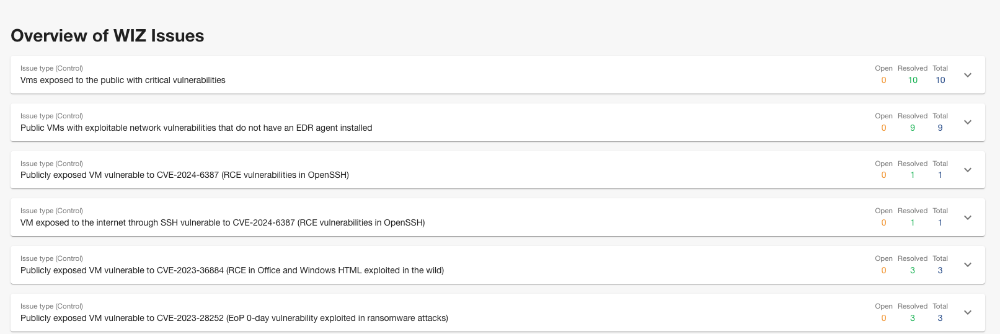
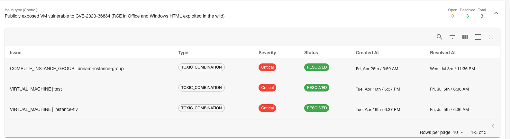
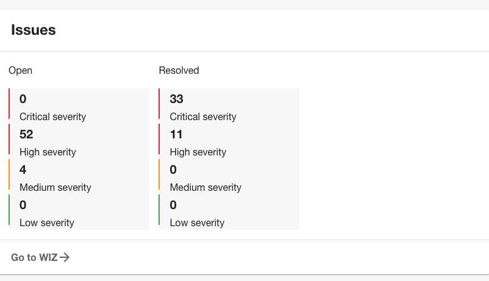
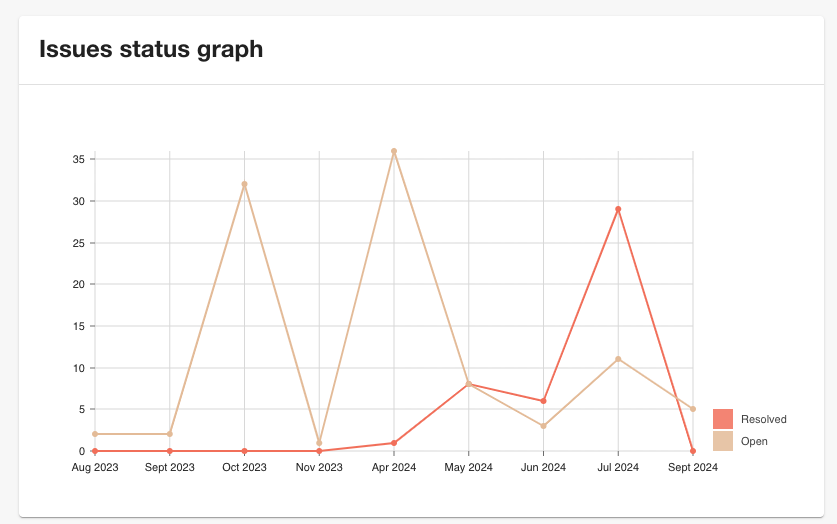
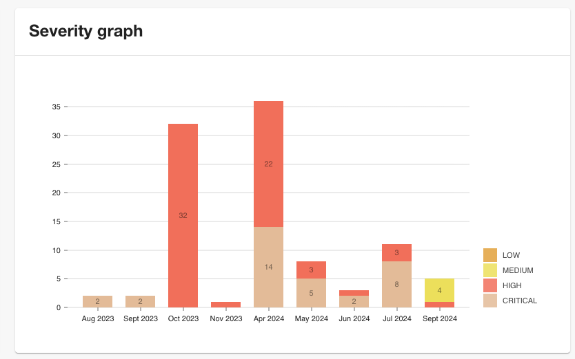

# Wiz Plugin for Backstage

This plugin is the frontend for WIZ Backend Backstage plugin. You can see the corresponding backend plugin in [here](../../backend/wiz-backend/README.md).

.

.
.
.

## Features

Wiz Issues Component:

- Shows last 500 issues created for the project, grouped by Controls

Issues widget Component:

- Shows number of open issues for last 500 issues created, grouped by severity

Issues chart Component:

- Shows graph of last 500 issues created, with number of resolved and open issues for last 6 months

Severity chart Component:

- Shows graph of last 500 issues created, grouped by severity, over time of last 6 months

## Getting started

Make sure you have installed [WIZ backend plugin](../../backend/wiz-backend/README.md). This will generate access token needed for retriving and displaying issues in components.

**_Note: v2 of this plugin (wiz-frontend) requires v2 of the wiz-backend plugin_**

### Add plugin component to your Backstage instance:

```ts
// packages/app/src/components/catalog/EntityPage.tsx
import {
  EntityWizIssues,
  isWizAvailable,
  EntityIssuesWidget,
  EntityIssuesChart,
  EntitySeverityChart,
} from '@roadiehq/backstage-plugin-wiz';
```

### Add widgets: EntityIssuesWidget, EntityIssuesChart, EntitySeverityChart

In the `packages/app/src/components/catalog/EntityPage.tsx` under `overviewContent` add the following, based on which card (widget) you want to display:

```jsx
<EntitySwitch>
  <EntitySwitch.Case if={isWizAvailable}>
    <Grid item md={6}>
      <EntityIssuesWidget />
    </Grid>
  </EntitySwitch.Case>
</EntitySwitch>

<EntitySwitch>
  <EntitySwitch.Case if={isWizAvailable}>
    <Grid item md={6}>
      <EntityIssuesChart />
    </Grid>
  </EntitySwitch.Case>
</EntitySwitch>

<EntitySwitch>
  <EntitySwitch.Case if={isWizAvailable}>
    <Grid item md={6}>
      <EntitySeverityChart />
    </Grid>
  </EntitySwitch.Case>
</EntitySwitch>
```

In order to add correct url which will lead to WIZ dashboard for your organisation, for EntityIssuesWidget, add dashboard link in your app-config.yaml under wiz.

```yaml
wiz:
  dashboardLink: <your-wiz-url>
  clientId: <Client ID>
  clientSecret: <Client Secret>
  tokenUrl: <Wiz token URL>
  wizAPIUrl: <API Endpoint URL>
```

### EntityWizIssues

In the `packages/app/src/components/catalog/EntityPage.tsx` under `serviceEntityPage` add the following:

```jsx
<EntityLayout.Route path="/wiz" title="WIZ">
  <EntityWizIssues />
</EntityLayout.Route>
```

This will add a new tab with all the issues for the project id you have specified in annotations.

## How to use add correct annotations

1. Add annotation to the yaml config file of a component:

```yaml
metadata:
  annotations:
    wiz.io/project-id: <your-project-id>
```

## New Frontend System

Install the plugin in your Backstage app:

```bash
# From your Backstage root directory
yarn --cwd packages/app add @roadiehq/backstage-plugin-wiz
```

If you're using [feature discovery](https://backstage.io/docs/frontend-system/architecture/app/#feature-discovery), the plugin should be automatically discovered and enabled. Otherwise, you can manually enable the plugin by adding it to your app:

```tsx
// packages/app/src/App.tsx
import wizPlugin from '@roadiehq/backstage-plugin-wiz/alpha';

const app = createApp({
  features: [wizPlugin],
});
```

You can tailor the registered entity content and cards via configuration:

```yaml
# app-config.yaml
app:
  extensions:
    - entity-content:wiz/issues:
        config:
          filter:
            kind: component
    - entity-card:wiz/issues-widget:
        config:
          type: info
    - entity-card:wiz/issues-chart:
        config:
          type: content
    - entity-card:wiz/severity-chart:
        config:
          type: content
```
