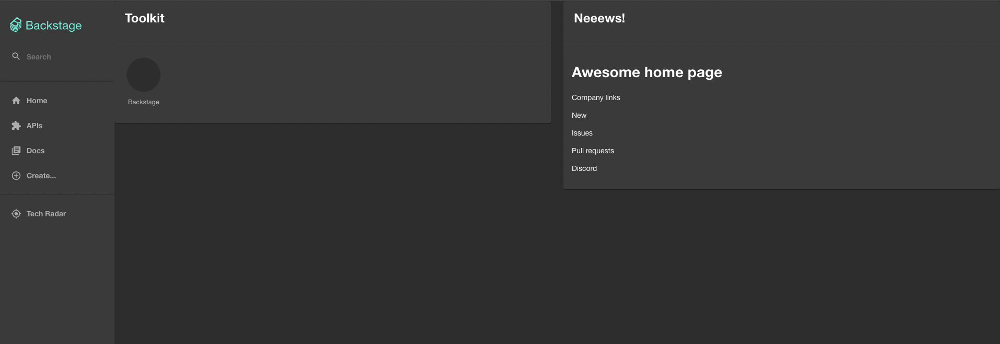

# Markdown Home page plugin

A React component that renders a markdown file from GitHub as a Homepage component. You'll need to log in to GitHub to be able to fetch the markdown.
You can configure the plugin to point to a remote markdown file in GitHub and it will fetch that markdown file and render it inside a card component.
It fetches on every render, but it caches based on the etag that gets returned by the GitHub api.

For the resources (links & images) currently you should use publicly available absolute urls. For example:
Make sure you use `raw` in the url instad of `blob` if you copy and paste from the browser.

```diff
- 
+ 
```

NB: Images hosted in private repositories in GitHub will not render as the [`react-markdown`](https://github.com/remarkjs/react-markdown) library used under the hood does not support authenticated requests.

## Preview


## Setup

If you didn't set up the HomePage plugin you can see the official documentation about it [here](https://github.com/backstage/backstage/tree/master/plugins/home). You'll need to have it setup to be able to include this plugin.
Add the following componenet to your HomePage.tsx file. The `HomePageMarkdown` props are the following type.

```bash
yarn add @roadiehq/backstage-plugin-home-markdown
```

```ts
export type MarkdownContentProps = {
  owner: string;
  repo: string;
  path: string;
  branch?: string;
};
```

```tsx
// packages/app/src/components/home/HomePage.tsx
import { HomePageMarkdown } from '@roadiehq/backstage-plugin-home-markdown';

export const HomePage = () => {
    return (
...
    <Grid item xs={12} md={6}>
        <HomePageMarkdown
            title="Neeews!"
            owner="RoadieHQ"
            repo="roadie-backstage-plugins"
            path=".backstage/README.md"
        />
    </Grid>
...
);
};
```

Please note that the [workflow status badge](https://docs.github.com/en/actions/monitoring-and-troubleshooting-workflows/adding-a-workflow-status-badge) feature in GitHub will not work with the markdown plugin.
